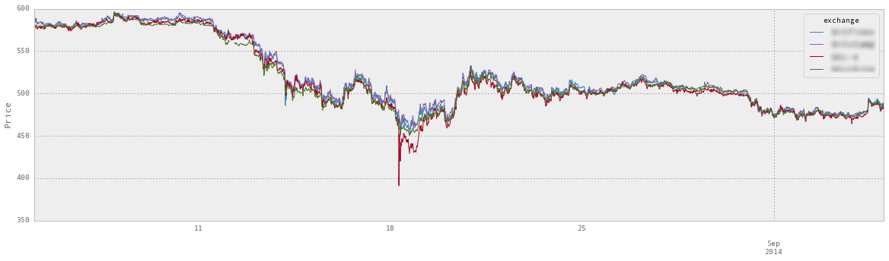
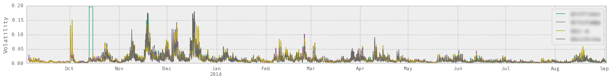

# SCALE ANALYTICS - TECHNICAL MATERIALS

**Client:** Financial Service

**Topic:** Alternative Currency Analytics for Global Bank Portfolios

**Contents:** Code and Output Samples

**Notes:**

* *Client and proprietary information removed* 
* *All material is strictly confidential and requires express permision of Scale Analytics to view.*
* *DO NOT NOT DISTRIBUTE*

# Project Overview

Client Goal: Dominate the $15 billion opportunity for bridging the gap between tradional global investing practice and crypto-currency distributed trust systems.  

Data Science Need: Establish a reliable, transparent and statistically valid series of metrics that can form the baseline tracking index for currencies such as Bitcoin.  Requirements include the need for additional financial tools such as ETFs to be built on top while conforming to interests of both financial consumers and providers.

# DATA EXPLORATION

Use the "ACES" framework (Acquire, Clean, Explore, Summarize) to analyze historical bitcoin data from leading exchanges and prepare for metrics.

    

## Acquire

Following SQL readings from publically and privately available historical data, CSVs of specific time-series data were generated.  These are then imported with desired characteristics.

    # Load file if necessary
    df = pd.io.parsers.read_csv('data/vwap_all_usd.csv',parse_dates=True,index_col=False)
    df = df[['timestamp','exchange','vwap_usd']] 

    # Select exchanges -- Exclude Gox, kraken, itbit, include Bitstamp
    
    EXCH = ['bitfinex', 'bitstamp', 'btc-e', 'btcchina']
    df = df[df.exchange.isin(EXCH)]
    
    # Output protection file
    #df.to_csv('data/vwap_finalstretch.csv')
    

Each exchange is prepared with specific windows and time periods to enable correlations and comparisons.

    # Load the data from csv land
    
    btce = pd.read_csv("data/ExchangeData/btceUSD_15min.csv"); btce['DateTime']=pd.to_datetime(btce['DateTime'])
    btce=btce.set_index('DateTime')
    btce.Volume=pd.rolling_sum(btce.Volume,window=96,min_periods=20)
    
    bitstamp = pd.read_csv("data/ExchangeData/bitstampUSD_15min.csv"); bitstamp['DateTime']=pd.to_datetime(bitstamp['DateTime'])
    bitstamp=bitstamp.set_index('DateTime')
    bitstamp.Volume=pd.rolling_sum(bitstamp.Volume,window=96,min_periods=20)
    
    bitfinex = pd.read_csv("data/ExchangeData/bitfinexUSD_15min.csv"); bitfinex['DateTime']=pd.to_datetime(bitfinex['DateTime'])
    bitfinex=bitfinex.set_index('DateTime')
    bitfinex.Volume=pd.rolling_sum(bitfinex.Volume,window=96,min_periods=20)
    
    btcn = pd.read_csv("data/ExchangeData/btcnUSD_15min.csv"); btcn['DateTime']=pd.to_datetime(btcn['DateTime'])
    btcn=btcn.set_index('DateTime')
    btcn.Volume=pd.rolling_sum(btcn.Volume,window=96,min_periods=20)

## CLEAN

Data is arranged in dictionaries with NaN removed and then in record formats to produce volume and pricing metrics.

    # Prep data for C01 calculation
    exch_prices=pd.concat([bitstamp.Price,bitfinex.Price,btcn.Price,btce.Price],axis=1).dropna()
    exch_volumes=pd.concat([bitstamp.Volume,bitfinex.Volume,btcn.Volume,btce.Volume],axis=1).dropna()

    # Add columns for dict conversion
    exch_volumes.columns=['bitstamp','bitfinex','btcn','btce']
    exch_prices.columns=['bitstamp','bitfinex','btcn','btce']

    exch_prices_dict = exch_prices.to_dict()
    exch_volumes_dict = exch_prices.to_dict()
    exch_times=exch_prices.index

    exch_prices_dict = exch_prices.to_dict(outtype='records')
    exch_volumes_dict = exch_volumes.to_dict(outtype='records')

    exch_volumes_dict[40]

    {'bitfinex': 243.93888877999996,
     'bitstamp': 147.88063721000003,
     'btce': 30.900787350000019,
     'btcn': 205.66300000000001}

    exch_prices_dict[40]

    {'bitfinex': 119.02,
     'bitstamp': 118.33,
     'btce': 114.0,
     'btcn': 117.38383216057591}

    C01 = pd.DataFrame(index=exch_times)

    C01['value']=0

    

    exch_volumes_dict[0]
    exch_prices_dict[0]

    {'bitfinex': 117.48999999999999,
     'bitstamp': 122.42,
     'btce': 115.824,
     'btcn': 118.06478809299914}

Conversions to 24 aggregate volumes and pricing for proprietary index calculations.
    
    # %load modC01.py
    import numpy
    

    def calc_C01(volumes_24h, usd_prices, verbose=False):
      v = volumes_24h
      p = usd_prices
    
      total_24h_volume = reduce(lambda x, y: x + y, v.values(), 0.0)
    
      use_p = []
      really_use_p = []
      min_volume_pct = 1.0/1000
      min_volume = total_24h_volume * min_volume_pct
      for pair in v.keys():
        if v[pair] < min_volume:
          if verbose: print 'excluding %s: volume %s, less than %s (total %s)\n' % (pair, v[pair], min_volume, total_24h_volume)
        else:
          use_p.append(p[pair])
    
      mean = numpy.mean(use_p)
      if not mean > 0.0:
        raise Exception('bad mean: %s' % (mean))
      else:
        if verbose: print 'dirty mean %f' % (mean)
    
      std = numpy.std(use_p)
      if not std > 0.0:
        raise Exception('bad std: %s' % (std))
      else:
        if verbose: print 'dirty stdd %f' % (std)
    
      for cp in use_p:
        if cp >= (mean - std*2) and cp <= (mean + std*2):
          really_use_p.append(cp)
        else:
          if verbose: print 'excluding price %s, too far away from mean %s (std %s)' % (cp, mean, std)
    
      mean = numpy.mean(really_use_p)
      if not mean > 0.0:
        raise Exception('bad mean: %s' % (mean))
      else:
        if verbose: print 'final mean %f' % (mean)
    
      std = numpy.std(really_use_p)
      if not std > 0.0:
        raise Exception('bad std: %s' % (std))
      else:
        if verbose: print 'final stdd %f' % (std)
    
      max_distance_factor = 0.75
      n = 0.0
      d = 0.0
      for pair in v.keys():
        distance_factor = ((mean - p[pair])/std) ** 2
        if distance_factor < max_distance_factor:
          distance_factor = max_distance_factor
        n += v[pair] * p[pair] / distance_factor
        d += v[pair] / distance_factor
    
      final_n = n
      final_d = d
    
      return final_n/final_d
    

    for i in np.arange(0,len(exch_times)):
        C01.value[i]=calc_C01(exch_volumes_dict[i],exch_prices_dict[i],verbose=False)
        

##  Explore

Provide basic plots of data to lay the grounds for evaluative metrics.

    
    
    #Date
    beg="2013-08-01"
    end="2014-07-01"
    
    plt.figure(figsize=(20,6))
    plt.title('24 Hour Volumes')
    btce[beg:end].Volume.plot(label='btce')
    bitfinex[beg:end].Volume.plot(label='bitfinex')
    bitstamp[beg:end].Volume.plot(label='bitstamp')
    btcn[beg:end].Volume.plot(label='btcn')
    plt.legend()
    
    plt.figure(figsize=(20,6))
    plt.title('Price')
    btce[beg:end].Price.plot(label='btce')
    bitfinex[beg:end].Price.plot(label='bitfinex')
    bitstamp[beg:end].Price.plot(label='bitstamp')
    btcn[beg:end].Price.plot(label='btcn')
    
    C01[beg:end].plot(title='C01',figsize=(20,6))

    <matplotlib.axes._subplots.AxesSubplot at 0x1090a3f10>

## Subset

    

### Separate the Data by Exchange and Plot

    # Prep a new pivot table to separate the indices
    dfpivot=df.pivot(index='timestamp', columns='exchange', values='vwap_usd')
    
    # Set the index to datetime
    dfpivot.index = pd.to_datetime(dfpivot.index)

    # Add the mean and std to the df
    EXCH = ['bitfinex','bitstamp','btc-e','btcchina']
    dfpivot['_mean']=dfpivot[EXCH].mean(axis=1)
    dfpivot['_std']=dfpivot[EXCH].std(axis=1,ddof=0)

#### Exchanges and Price Standard Deviation

    # Plot the exchanges
    beg="2013-09-15"
    end="2014-09-15"
    dfpivot[beg:end].plot(figsize=(20,10),cmap='Dark2',alpha=.9,title='Exchange Prices for BTC '+beg+' to '+end+'\n')
    plt.ylabel('Price')

    <matplotlib.text.Text at 0x10baa7090>

    # Calculate Daily Returns
    def returns(_data,_freq='D'):
        """"Calculate Daily Returns
        'D' = Daily
        'H' = Hourly
        """
        return(np.log(_data/_data.shift(-1,freq=_freq)))

    

    # Resample based on last and get daily and hourly returns
    df_returns = returns(dfpivot[EXCH].resample('D',how='last'))
    df_hourly_returns = returns(dfpivot[EXCH].resample('H',how='last'))

    # Calculate returns std and mean
    df_returns['_mean']=df_returns.mean(axis=1)
    df_returns['_std']=df_returns.std(axis=1,ddof=0)
    
    df_hourly_returns['_mean']=df_returns.mean(axis=1)
    df_hourly_returns['_std']=df_returns.std(axis=1,ddof=0)

#### Daily Returns and Standard Deviation of Returns

    # Plot Daily Returns
    def plot_daily_returns(df=df_returns,beg='2013-09-15',end='2014-09-15'):
        plt.figure(figsize=(20,8))
        plt.title('Daily Returns for BTC '+beg+' to '+end+'\n',fontsize=25)
        #plt.legend()
    
    
        
        #plt.legend()
        plt.plot(df_returns[EXCH][beg:end])
        plt.ylabel("Percentage Return",fontsize=20)
        plt.twinx()
        plt.ylabel("Standard Deviation of Returns")
        #df_returns[EXCH][beg:end].plot()
        plt.plot(df_returns[['_std']][beg:end],label='STD',linewidth=4,color='b')
        plt.legend()
        return()

    plot_daily_returns()

    ()

    plot_daily_returns(beg='2014-08-01',end='2014-08-30')

    ()

    

#### Daily Returns and Volatility

    

    # Plot Daily Returns
    df_returns[EXCH][beg:end].plot(figsize=(20,7),cmap='Dark2',alpha=.9,title='Daily Returns for BTC '+beg+' to '+end+'\n')
    df_returns[['_std']][beg:end].plot(figsize=(20,5))

    <matplotlib.axes._subplots.AxesSubplot at 0x10902be10>

#### Return STD Dots

    df_returns[['_std']][beg:end].plot(figsize=(20,5),marker="o",style='_')

    <matplotlib.axes._subplots.AxesSubplot at 0x11014a590>

# DELIVERABLES: METRICS
#### Using Absolute Returns Deviation as a Distortion Metric

    # Plot Hourly Returns
    beg="2014-05-01"
    end="2014-09-01"
    df_hourly_returns[EXCH][beg:end].plot(figsize=(20,7),cmap='Dark2',alpha=.9,title='Hourly Returns for BTC '+beg+' to '+end+'\n',ylim=(-.5,.5))
    df_hourly_returns[['_std']][beg:end].plot(figsize=(20,5),ylim=(.005,.001),marker='*')

    <matplotlib.axes._subplots.AxesSubplot at 0x1131840d0>

#### Using Volatility

Or, we have volatility at unit =  STD(t) * sqrt (t / unit)

Where t = daily (if daily returns) or t = hourly (if hourly returns)

Then, if unit is monthly, then t/unit = days/month = 30.

Or, per below, we just keep unit and t the same, then we can use the daily
volatility (sqrt (t / unit) = 1)

    # Calculate volatility
    # Standard Deviation of Returns over 30 day volatility
    def volatility(_data,timeperiod=30,_freq='D'):
        return(pd.rolling_std(returns(_data,_freq),timeperiod))

    # Calculate 

    # Create a matrix with all volatilites to compare
    def comparevolatility(_data,startdate,enddate):
        """Compare Volatility
        Give a dataframe of returns and produce a boxplot
        
        Example:
        --------
        >>> comparevolatility(XALL,'2014-06-05','2014-06-07')
        >>> plt.ylim(0,.05) # You may want to use the ylim to set boundaries on large variances
        """
        
        volatilitymatrix = pd.DataFrame()
        for c in _data.columns:
            volatilitymatrix[c]=volatility(_data[c])
          
            
        
        # Produce boxplot for the period
    
        vm=volatilitymatrix[startdate:enddate].boxplot(return_type='axes')
        vm.set_ylabel('Volatility')
        plt.ylim(0,.015)
        print "Volatility Comparison from " + startdate + " to " + enddate
        
        
        
        
        # Plot the Price
        vm=_data[startdate:enddate].plot(figsize=(20,5))
        vm.set_ylabel('Price')
        vm.set_xlabel('')
        
        # Plot the volatility
        vm=volatilitymatrix[startdate:enddate].plot(figsize=(20,2))
        vm.set_ylabel('Volatility')
        vm.plot()
        
        # Add the volatility STD
        #volatilitymatrix['_std']=volatilitymatrix.std(axis=1,ddof=0)
        
        
        
        
        return(volatilitymatrix)

    # Plot Price and Volatility
    vm2 = comparevolatility(dfpivot[EXCH],'2014-08-05','2014-09-07')

    Volatility Comparison from 2014-08-05 to 2014-09-07

    vm2['_mean']=df_returns.mean(axis=1)
    vm2['_std']=df_returns.std(axis=1,ddof=0)
    vm2['_std_norm']=abs(vm2['_std']) / abs(vm2['_mean'])

    vm2.describe()

<table border="1" class="dataframe">
  <thead>
    <tr style="text-align: right;">
      <th></th>
      <th>bitfinex</th>
      <th>bitstamp</th>
      <th>btc-e</th>
      <th>btcchina</th>
      <th>_mean</th>
      <th>_std</th>
      <th>_std_norm</th>
    </tr>
  </thead>
  <tbody>
    <tr>
      <th>count</th>
      <td> 19704.000000</td>
      <td> 33087.000000</td>
      <td> 32384.000000</td>
      <td> 24359.000000</td>
      <td> 365.000000</td>
      <td> 365.000000</td>
      <td> 365.000000</td>
    </tr>
    <tr>
      <th>mean</th>
      <td>     0.018304</td>
      <td>     0.013800</td>
      <td>     0.013522</td>
      <td>     0.014397</td>
      <td>  -0.001754</td>
      <td>   0.017236</td>
      <td>   1.300657</td>
    </tr>
    <tr>
      <th>std</th>
      <td>     0.037267</td>
      <td>     0.015095</td>
      <td>     0.016036</td>
      <td>     0.017505</td>
      <td>   0.050168</td>
      <td>   0.022166</td>
      <td>   3.545348</td>
    </tr>
    <tr>
      <th>min</th>
      <td>     0.001251</td>
      <td>     0.001243</td>
      <td>     0.001154</td>
      <td>     0.000766</td>
      <td>  -0.315353</td>
      <td>   0.000658</td>
      <td>   0.401622</td>
    </tr>
    <tr>
      <th>25%</th>
      <td>     0.007362</td>
      <td>     0.005302</td>
      <td>     0.004725</td>
      <td>     0.004803</td>
      <td>  -0.019193</td>
      <td>   0.004901</td>
      <td>   0.429266</td>
    </tr>
    <tr>
      <th>50%</th>
      <td>     0.012059</td>
      <td>     0.009166</td>
      <td>     0.008546</td>
      <td>     0.009098</td>
      <td>   0.000159</td>
      <td>   0.009420</td>
      <td>   0.565295</td>
    </tr>
    <tr>
      <th>75%</th>
      <td>     0.020123</td>
      <td>     0.016149</td>
      <td>     0.015739</td>
      <td>     0.016675</td>
      <td>   0.013372</td>
      <td>   0.020682</td>
      <td>   0.880713</td>
    </tr>
    <tr>
      <th>max</th>
      <td>     0.902145</td>
      <td>     0.178549</td>
      <td>     0.164398</td>
      <td>     0.174871</td>
      <td>   0.297527</td>
      <td>   0.229243</td>
      <td>  46.660406</td>
    </tr>
  </tbody>
</table>

    

#### Trace Anomalies
* From 9/1/2013 to 9/1/2014
* Add distribution, frequency of anomalies

* Plot the histogram of all anomalies over that time period
* Plot the anomalies on a graph over that time period.
* Plot the monthly histograms of anomalies over that time period

    # Trace "Anomalies"
    # Anomalies are anywhere that Volatitility Dispersion is over .002

    vm = vm2 # Define vm as the volatility matrix holding anomaly source data

### Frequency of Anomalies

    # Set Time Period
    beg="2013-09-01"
    end="2014-09-01"
    
    # Set Anomaly Threshold
    thresh=.0026

    # Plot Anomalies
    plt.figure(figsize=(20,8))
    vm._std[vm._std > thresh][beg:end].plot(style='_',marker='o',ylim=(0,.04),alpha=.03)
    plt.title('Price Anomalies based on Volatility Dispersion\n'+beg+" to "+end+'\n\nThreshold = '+str(thresh)+'\n')

    <matplotlib.text.Text at 0x115f4b6d0>

    
    # Plot Anomalies with Prices Nearby
    plt.figure(figsize=(20,5))
    vm._std[vm._std > thresh][beg:end].plot(style='_',marker='o',ylim=(0,.04),alpha=.03)
    
    plt.title('Price Anomalies based on Volatility Dispersion\n'+beg+" to "+end+'\n\nThreshold = '+str(thresh)+'\n')
    
    
    dfpivot[beg:end][EXCH].plot(figsize=(20,5),cmap='Dark2',alpha=.9,title='Exchange Prices for BTC '+beg+' to '+end+'\n')
    
    
    ax=vm[beg:end][EXCH].plot(figsize=(20,2),cmap='Dark2',ylim=(0,.2))
    ax.set_ylabel('Volatility')
    ax.plot()

    []

####Plot the histogram of all anomalies over that time period

    #(data, column=None, by=None, grid=True, xlabelsize=None, xrot=None, ylabelsize=None, yrot=None, ax=None, sharex=False, sharey=False, figsize=None, layout=None, bins=10, **kwds)

    scope=beg+" to "+end

    # Histgoram Plot
    plt.figure(figsize=(20,8))
    vm._std[beg:end].hist(bins=50,range=[0, .02],label='all',alpha=.7)
    #plt.title('Distribution of Price Volality - No Threshold\n\n'+scope+'\n')
    plt.xlabel('Volality Dispersion', fontsize=14)
    
    thresh=.0026
    vm._std[beg:end][vm._std > thresh].hist(bins=50,range=[0, .02],label=str(thresh),alpha=.7)
    #plt.title('Distribution of Price Volality - Threshold at '+str(thresh)+'\n\n'+scope+'\n')
    plt.xlabel('Volality Dispersion', fontsize=12)
    
    thresh=.005
    vm._std[beg:end][vm._std > thresh].hist(bins=50,range=[0, .02],label=str(thresh),alpha=.7)
    plt.title('Distribution of Price Volality - Varied Threshholds\n\n'+scope+'\n')
    plt.xlabel('Volality Dispersion', fontsize=12)
    plt.ylabel('Number of Anomalies', fontsize=12)
    
    plt.legend(title='Threshold')

    <matplotlib.legend.Legend at 0x137299250>

    plt.figure(figsize=(20,3))
    thresh=.002
    beg='2014-01-01'
    end='2014-02-01'
    vm._std[beg:end][vm._std > thresh].hist(bins=50,range=[thresh, .01],label=str(thresh),alpha=.7)
    plt.title('Distribution of Price Volality - Threshold at '+str(thresh)+'\n\n'+beg+' to '+end+'\n')
    plt.xlabel('Volality Dispersion', fontsize=12)

    <matplotlib.text.Text at 0x15bbed850>

####Plot the anomalies on a graph over that time period.

    thresh=.005
    vm._std[beg:end][vm._std > thresh].plot(style='_',marker='o',alpha = .02,ylim=(.005,.05),figsize=(20,3))

    <matplotlib.axes._subplots.AxesSubplot at 0x14063a810>

    # Overlay the three indices

### Generate C01, Price Average, and Volume Weighted Price Average Indices

    # Load Files -- focus on non mtgox for now
    
    ## Import the Three Exchange Files
    
    # Price average of all exchanges minus itbit and vaur
    C01_AP = px_avg_index=pd.read_csv('data/px_avg_index_data.csv',parse_dates=True,index_col=0)
    C01_AP.columns=['C01_AP']
    
    # VWAP of all exchanges minus itbit and vaur
    C01_VWAP = vwap_index=pd.read_csv('data/vwap_index_data.csv',parse_dates=True,index_col=0)
    C01_VWAP.columns=['C01_VWAP']
    
    # Initial vwap data
    vwap=pd.read_csv('data/vwap_data.csv',index_col=0,parse_dates=True)
    
    # C01 setup
    a=vwap[vwap.exchange=='C01']
    b=vwap[vwap.exchange=='C012014051']
    C01=pd.DataFrame(a.append(b).vwap)
    C01.columns=['C01']
    
    
    Indices = [C01_AP,C01_VWAP,C01]
    
    
    
    # Combine Indices
    XALL= C01.join([C01_AP,C01_VWAP],how='outer')

    beg="2013-09-01"
    end="2014-09-01"
    thresh=.005
    plt.title('Price Anomalies based on Volatility Dispersion\n'+beg+" to "+end+'\n\nThreshold = '+str(thresh)+'\n')
    
    vm._std[beg:end][vm._std > thresh].plot(style='_',marker='o',alpha = .1,ylim=(.005,.05),figsize=(20,3))
    XALL[beg:end].plot(style='-',alpha=.5,figsize=(20,3))

    <matplotlib.axes._subplots.AxesSubplot at 0x15bb80cd0>

    

    

### Note
What we want to examine in this case is the anomalies in terms of the *rolling*
standard deviations from the mean.

When we see a spike in the standard deviation, we can measure that spike by
comparing it to the standard deviations in the surrounding days (or hours).

Otherwise, we will always expect to see a distance from the mean at any given
point in time for an exchange that is within 2 standard deviations, by
definition -- because the standard deviation is expanding and contracting along
with the exchanges at each point in time.

So, our formula will be like:

1) When the std of the indices is x% greater than the rolling std (at time t),
that's an anomaly

2) Using a 'volatility' measure as already computed

3) Using the divergence measure calculated by coinometrics

    

    

    # Quick plot of the anomalies
    anomalies._std.plot(title='Standard Deviations of Exchanges (VWAP) \n',figsize=(20,8))
    anomalies[EXCH_distance].plot(figsize=(20,8),style='_',marker='o',alpha=.2)

    <matplotlib.axes._subplots.AxesSubplot at 0x12b21c990>

    

    

    

    

## Index performance during anomalies at a summary / macro level

* Calculate the 'resilience' score again for each index.
* Create the reslience graph over time
* Create the overall box plot
* create the boxplot for the days with "major anomolies"

#### Resilience Scores

    #At the moment of a price anomaly, calculate the distance of the index from that price.

#### Anomaly Metric Framework

    # Bring in the Price Anomoly 
    
    import pickle
    COMBO = pickle.load(open("data/COMBO.pkl","rb"))

    COMBO['C01_Resilience']=abs(COMBO['pa'] - COMBO['C01']) / COMBO['C01']
    COMBO['C01_AP_Resilience']=abs(COMBO['pa'] - COMBO['C01_AP']) / COMBO['C01_AP']
    COMBO['C01_VWAP_Resilience']=abs(COMBO['pa'] - COMBO['C01_VWAP']) / COMBO['C01_VWAP']
    
    ## Starts
    
    COMBO['C01_Resilience_Starts']=abs(COMBO['pas'] - COMBO['C01']) / COMBO['C01']
    COMBO['C01_AP_Resilience_Starts']=abs(COMBO['pas'] - COMBO['C01_AP']) / COMBO['C01_AP']
    COMBO['C01_VWAP_Resilience_Starts']=abs(COMBO['pas'] - COMBO['C01_VWAP']) / COMBO['C01_VWAP']
    
    
    # Store metrics
    C01_Columns = ['C01_AP','C01_VWAP','C01']
    C01_Resilience = ['C01_Resilience','C01_AP_Resilience','C01_VWAP_Resilience']
    C01_Resilience_Starts = ['C01_Resilience_Starts','C01_AP_Resilience_Starts','C01_VWAP_Resilience_Starts']

#### Resilience Comparisons

    plt.figure(figsize=(10,5))
    COMBO[beg:end][C01_Resilience].boxplot()
    plt.suptitle('Resilence Comparison for Three Indices',y=1.04,fontsize=15)
    plt.title(beg+" to "+end+"\n")

    <matplotlib.text.Text at 0x162b54810>

    beg="2013-09-01"
    end="2014-09-01"
    plt.figure(figsize=(10,5))
    COMBO[beg:end][C01_Resilience].boxplot()
    plt.suptitle('Resilence Comparison for Three Indices',y=1.04,fontsize=15)
    plt.title(beg+" to "+end+"\n")

    <matplotlib.text.Text at 0x1633cfa50>

    # Resilience Over Time
    COMBO[beg:end][C01_Resilience].plot(figsize=(20,8),alpha=.1,style='_',marker='o',cmap='jet')
    plt.suptitle('Resilence Comparison for Three Indices',y=1.04,fontsize=15)
    plt.title(beg+" to "+end+"\n")

    <matplotlib.text.Text at 0x1a455fed0>

